<h1 align="left">
  👨🏻‍💻 Pablo Queiroz
  
</h1>

**`Full Stack Developer`**

My name is Pablo Queiroz, and I am focused on growing my career in web development, with a strong interest in JavaScript, React, Node.js, and full stack applications. I completed a Web Development Bootcamp at Ironhack and I am currently pursuing a postgraduate program in Software Engineering.

I have been building practical projects with HTML, CSS, JavaScript, TypeScript, React, Node.js, Express, REST APIs, MongoDB, Mongoose, Git, GitHub, npm, JWT, and Bcrypt. I have also been expanding my skills with PostgreSQL, Prisma, Next.js, and Python through recent hands-on practice and personal projects.

In addition to my technical path, I bring more than 10 years of experience in corporate environments, which strengthened my communication, adaptability, problem-solving, and collaboration skills.

  
  
  
  

---

### 🤖 Languages and Technologies

 
 

### 📊 Statistics

&nbsp;&nbsp;

